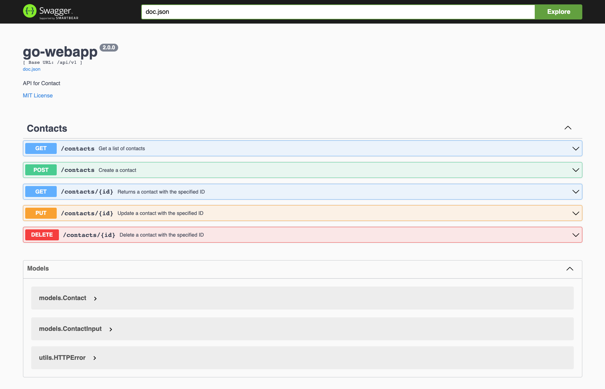
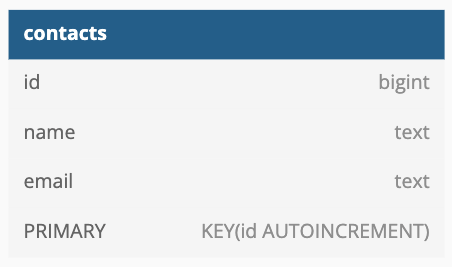
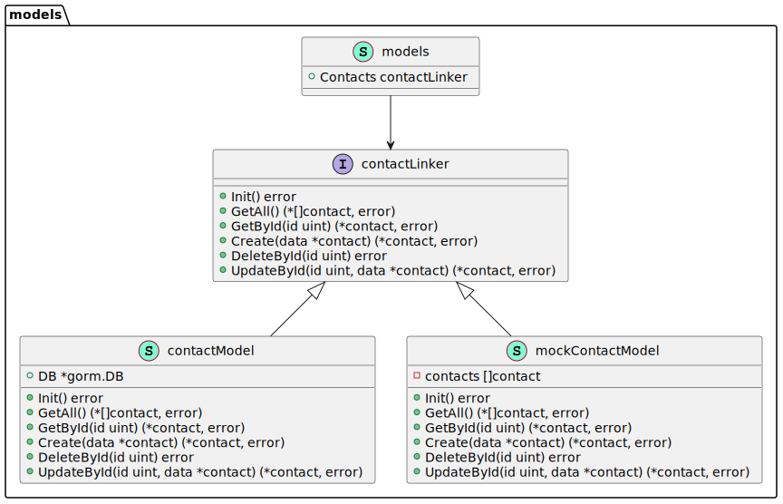
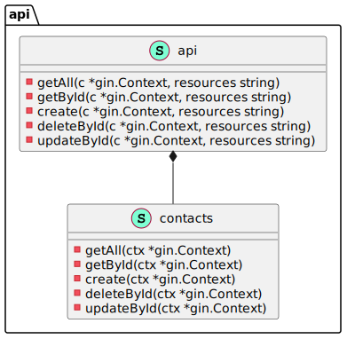

# go-webapp

[](https://github.com/rafikurnia/go-webapp/actions/workflows/go.yml)

A simple Hello World web application and contact API written in Go and uses [gin-gonic](https://gin-gonic.com/) web framework.


## Prerequisites

- Go 1.18.1 (Optional, only if you want to run the application on local machine or perform unit test)
- Docker 19.03.0+


## Getting Started

After you have all prerequisites install, to run the application, you can follow these steps:

1. Run the application using docker-compose via makefile:
   ```bash
   make compose-up
   ```

2. The application will run on the container and listen on port `8080`, and it is mapped to your
   local machine on port 80. Thus, make sure that the port is not occupied.

   After the application is running, you can access it using your web browser on the following link:
   ```bash
   http://localhost/
   ```

   Or, using curl:
   ```bash
   curl -v http://localhost/
   ```

3. You can access Swagger that is included in the application. It is helpful to easily navigate
   between supported API resources and methods. You can access it using your web browser on the
   following link:
   ```bash
   http://localhost/swagger/index.html
   ```

   A figure below illustrates the Swagger UI:
   


4. When you are finished using the application, you can shut down and remove all resources using the
   following command:
   ```bash
   make compose-down
   ```


## Configure Application Parameters

You can update some parameters of the application inside [./config.env](./config.env) file. Table
below explains each parameter in the file:

| Name                          | Description                                                                               |
| ----------------------------- | ----------------------------------------------------------------------------------------- |
| APP_NAME                      | The name of the application. It will be used as the docker image and container name.      |
| VERSION                       | The version of the application. It will be used as a tag for the docker image.            |
| APP_PORT                      | The port number where the application will listen to incoming connections.                |
| HOST_PORT                     | The port number to access the application from host machine.                              |
| GIN_MODE                      | To inform gin-gonic web framework about the environment where the application is running. |
| NUMBER_OF_REPLICAS            | A number of container of the web app running. Adjust this value to scale horizontally.    |
| CPU_LIMIT                     | A maximum number of CPU that the container can use.                                       |
| MEM_LIMIT                     | A maximum amount of memory that the container can use.                                    |
| CPU_RESERVED                  | A number of CPU that is reserved for the container to use.                                |
| MEM_RESERVED                  | An amount of memory that is reserved for container to use.                                |
| NUMBER_OF_REQUESTS            | A number of requests to perform on the benchmarking using ApacheBench.                    |
| NUMBER_OF_CONCURRENT_REQUESTS | A number of multiple requests to make at a time on the benchmarking using ApacheBench.    |
| POSTGRES_PASSWORD             | The password to access PostgreSQL engine running in Docker.                               |
| POSTGRES_USER                 | The name of the user in the PostgreSQL.                                                   |
| POSTGRES_DB                   | The name of the database in the PostgreSQL.                                               |
| POSTGRES_HOST                 | The location where the PostgreSQL is running.                                             |
| POSTGRES_PORT                 | The port number of the PostgreSQL.                                                        |
| POSTGRES_SSL                  | Enable ssl connection on the PostgresSQL.                                                 |
| POSTGRES_TIMEZONE             | The timezone of the machine of PostgresSQL.                                               |
| TZ                            | The timezone of the docker containers.                                                    |


## Makefile help

This project is shipped with Makefile to help on automating the a chain of executions of certain
actions. Table below shows a list of available makefile targets and their description.

| Target          | Description                                                              |
| --------------- | ------------------------------------------------------------------------ |
| help            | Show help menu                                                           |
| go-build        | Build Go code                                                            |
| go-test         | Test Go code                                                             |
| go-run          | Run Go code                                                              |
| go-rm           | Delete the app binary file                                               |
| docker-build    | Build an image from a Dockerfile with tag APP_NAME:VERSION               |
| docker-build-ne | Build the image only if it does not exist                                |
| docker-run      | Build the image if it does not exists and start container from the image |
| docker-rm       | Delete the image                                                         |
| docker-test     | Test app on docker                                                       |
| compose-up      | Build the image if not exist and start containers using docker-compose   |
| compose-down    | Stop and remove containers and networks created by docker-compose        |
| benchmark       | Run the containers and perform benchmark using apachebench               |
| test            | Run the containers and perform CRUD test using custom scripts            |
| clean           | Remove all resources possibly made by this makefile                      |

You can invoke any of the command above by calling `make <target>`.


## Table schema

The picture below shows table schema:



The contact information only contains name and email, whereas no unique constraint is put on them.
The reason for this decision is that different people can have the same name. In addition, the same
person who has the same email address may have other names. There may be two entries with different
names having the same email address.


## Mock database

As illustrated in the diagram below, the connection between the API and the database tier is through
interfaces. Therefore, the database tier can hide its implementation details, making the code more
loosely coupled and easier to be tested.




## Running unit test locally

To run the test locally on your machine, you can invoke the following command:
```bash
make go-test
```

## Running test on Docker

Although it is advantageous to have a mock database for the test, we may miss something during the
mocking. Thus, the actual DB engine may still be preferable for testing. To do this, a separate
docker-compose file was created for this purpose. To perform the test, you can use these commands:

```bash
make docker-test
```

Both local and Docker tests are included and performed in the GitHub action workflow
[](https://github.com/rafikurnia/go-webapp/actions/workflows/go.yml)


## API resources

The application supports only one resource, i.e., contacts. However, a composition can be implemented
on the code increase code reusability. Therefore, should we need to add more resources in the future,
the development will be faster.




## Author

[Rafi Kurnia Putra](https://github.com/rafikurnia)


## License

MIT License. See [LICENSE](./LICENSE) for full details.
